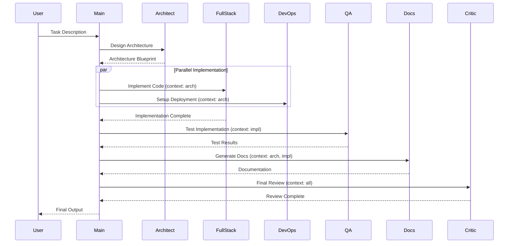

# Unified Orchestrator API Documentation

## Overview

The Unified Orchestrator provides a multi-agent AI system for building complete software projects. This document describes the main entry points, configuration options, and agent capabilities.

## Command Line Interface

### Main Entry Point

```bash
python main.py [TASK] [OPTIONS]
```

### Arguments

| Argument | Type | Required | Description |
|----------|------|----------|-------------|
| `TASK` | string | Yes | Natural language description of the project to build |
| `--backend` | choice | No | LLM backend: `ollama`, `mlx`, `openai` (default: `ollama`) |
| `--benchmark` | flag | No | Enable performance metrics collection |

### Examples

```bash
# Build a FastAPI service with Ollama
python main.py "Build a FastAPI notes service"

# Use MLX backend (Apple Silicon)
python main.py "Create a data pipeline" --backend mlx

# With benchmarking
python main.py "Build a REST API" --benchmark
```

## Agent Orchestration Flow

### Workflow Execution

The orchestrator follows a context-aware sequential workflow with parallel capabilities:



### Agent Endpoints (Internal)

Each agent is instantiated and managed internally by the orchestrator:

#### ArchitectAgent
- **Role**: System architecture design
- **Tools**: Planning, schema design
- **Output**: Architecture blueprint including tech stack, components, data flow, deployment strategy

#### FullStackAgent
- **Role**: Code implementation
- **Tools**: `write_file()`, `read_file()`, `validate_python_code()`, `create_project_files()`
- **Output**: Complete working implementation in `src/generated/`

#### QAAgent
- **Role**: Testing and validation
- **Tools**: `test_code()`, `read_file()`, `validate_python_code()`
- **Output**: Test results with >80% coverage, identified issues

#### DevOpsAgent
- **Role**: Deployment and infrastructure
- **Tools**: `create_project_structure()`, `generate_requirements()`, `write_file()`
- **Output**: Dockerfile, docker-compose.yml, CI/CD configuration

#### DocsAgent
- **Role**: Documentation generation
- **Tools**: `write_file()`, `read_file()`, `get_current_date()`
- **Output**: README.md, API docs, setup guides

#### CriticAgent
- **Role**: Quality review and security assessment
- **Tools**: Code analysis, security scanning
- **Output**: Comprehensive review with recommendations

## Configuration API

### Environment Variables

Configuration is managed through `.env` file:

```bash
# LLM Backend Selection
MODEL_BACKEND=ollama|mlx|openai|anthropic|huggingface
MODEL_NAME=llama3.1:8b-instruct-q5_K_M
MODEL_TEMPERATURE=0.7
MODEL_MAX_TOKENS=2048

# Ollama Configuration
OLLAMA_BASE_URL=http://localhost:11434
OLLAMA_NUM_THREAD=16
OLLAMA_NUM_BATCH=2048
OLLAMA_NUM_GPU=40
OLLAMA_NUM_CTX=8192

# MLX Configuration (Apple Silicon)
MLX_MODEL_PATH=mlx_models/llama3-8b
MLX_MAX_TOKENS=512

# Execution
PARALLEL_MODE=true
MAX_CONCURRENT_TASKS=8

# Memory & Storage
MEMORY_TYPE=chroma
VECTOR_STORE=chromadb|faiss
FAISS_INDEX_PATH=.faiss

# API Keys (Optional)
OPENAI_API_KEY=sk-...
ANTHROPIC_API_KEY=sk-ant-...
HF_TOKEN=hf_...

# Logging & Metrics
LOG_LEVEL=INFO|DEBUG|WARNING|ERROR
ENABLE_METRICS=true
```

### Python Configuration API

```python
from config import MODEL_CONFIG, get_llm_backend

# Get configured LLM backend
llm = get_llm_backend()

# Model configuration
model_config = MODEL_CONFIG
# Returns: {
#   "model_name": "gpt-4o",
#   "temperature": 0.7,
#   "max_tokens": 2048
# }
```

## Agent Tool API

### FullStackAgent Tools

#### write_file(path: str, content: str) → bool
Writes content to a file, creating directories as needed.

**Parameters:**
- `path`: Relative file path from project root
- `content`: File content to write

**Returns:** Success status

**Example:**
```python
write_file("src/api/main.py", "from fastapi import FastAPI...")
```

#### read_file(path: str) → str
Reads content from a file.

**Parameters:**
- `path`: Relative file path from project root

**Returns:** File content as string

#### validate_python_code(code: str) → dict
Validates Python code syntax.

**Parameters:**
- `code`: Python code string

**Returns:** Validation result with errors if any

#### create_project_files(files: dict) → bool
Creates multiple files in one operation.

**Parameters:**
- `files`: Dictionary of {path: content}

**Returns:** Success status

### DevOpsAgent Tools

#### create_project_structure(structure: dict) → bool
Creates directory structure for the project.

**Parameters:**
- `structure`: Nested dict representing directory tree

**Returns:** Success status

**Example:**
```python
create_project_structure({
    "src": {
        "api": {},
        "models": {},
        "tests": {}
    }
})
```

#### generate_requirements(packages: list) → str
Generates requirements.txt content.

**Parameters:**
- `packages`: List of package names with versions

**Returns:** requirements.txt content

### QAAgent Tools

#### test_code(test_cases: list) → dict
Runs test cases and returns results.

**Parameters:**
- `test_cases`: List of test case definitions

**Returns:** Test results with coverage metrics

### DocsAgent Tools

#### get_current_date() → str
Returns current date for documentation timestamps.

**Returns:** ISO 8601 date string

## Output Structure

### Generated Files

All agent outputs are organized in the workspace:

```
src/generated/
├── api/              # API implementation (FullStackAgent)
├── models/           # Data models (FullStackAgent)
├── tests/            # Test suite (QAAgent)
├── deployment/       # Deployment configs (DevOpsAgent)
│   ├── Dockerfile
│   ├── docker-compose.yml
│   └── .github/workflows/
└── docs/             # Documentation (DocsAgent)
    ├── README.md
    ├── API.md
    └── ARCHITECTURE.md
```

### Metrics Output

When running with `--benchmark`, metrics are saved to:

```
logs/
└── metrics.json
```

**Metrics Schema:**
```json
{
  "orchestration": {
    "start_time": "2025-10-21T09:00:00Z",
    "end_time": "2025-10-21T09:05:00Z",
    "duration_seconds": 300,
    "agents": {
      "architect": {"duration": 45, "tokens": 1200},
      "fullstack": {"duration": 120, "tokens": 3500},
      "qa": {"duration": 60, "tokens": 1800},
      "devops": {"duration": 30, "tokens": 900},
      "docs": {"duration": 30, "tokens": 1100},
      "critic": {"duration": 15, "tokens": 600}
    },
    "total_tokens": 9100,
    "success": true
  }
}
```

## Error Handling

### Error Response Format

Errors are logged with structured information:

```python
{
  "error_type": "ValidationError|RuntimeError|ConfigError",
  "message": "Human-readable error message",
  "agent": "architect|fullstack|qa|devops|docs|critic",
  "timestamp": "2025-10-21T09:00:00Z",
  "traceback": "Full stack trace"
}
```

### Common Errors

| Error Code | Description | Resolution |
|------------|-------------|------------|
| `BACKEND_NOT_FOUND` | LLM backend not available | Check Ollama is running or API keys are set |
| `MODEL_NOT_LOADED` | Model not found | Pull model with `ollama pull <model>` |
| `TOOL_EXECUTION_ERROR` | Agent tool failed | Check file permissions and paths |
| `VALIDATION_ERROR` | Invalid configuration | Review `.env` file settings |
| `MEMORY_ERROR` | Vector store initialization failed | Check ChromaDB or FAISS configuration |

## Performance Optimization

### Parallel Execution

Enable parallel agent execution for independent tasks:

```bash
# In .env
PARALLEL_MODE=true
MAX_CONCURRENT_TASKS=8  # Optimize for M3 Max
```

### Vector Store Selection

For large-scale operations (>10K vectors):

```bash
# Install FAISS
pip install faiss-cpu

# Configure in .env
VECTOR_STORE=faiss
FAISS_INDEX_PATH=.faiss
```

**Performance**: FAISS provides 50-125x faster vector search than ChromaDB.

### LLM Backend Optimization

**Ollama (M3 Max):**
```bash
OLLAMA_NUM_THREAD=16
OLLAMA_NUM_BATCH=2048
OLLAMA_NUM_GPU=40
OLLAMA_NUM_CTX=8192
```

**MLX (Apple Silicon):**
```bash
MODEL_BACKEND=mlx
MLX_MODEL_PATH=mlx_models/llama3-8b
```

## Integration Examples

### Python SDK

```python
from src.orchestrator.crew_config import ProductionCrew

# Create crew with task
crew = ProductionCrew("Build a FastAPI service for managing tasks")

# Execute workflow
result = crew.run()

# Access results
print(result)
```

### Async Execution

```python
import asyncio
from src.orchestrator.crew_config import ProductionCrew

async def run_orchestration():
    crew = ProductionCrew("Build a data pipeline")
    result = await asyncio.to_thread(crew.run)
    return result

result = asyncio.run(run_orchestration())
```

### Custom Agent Integration

```python
from crewai import Agent
from config import get_llm_backend

# Create custom agent
custom_agent = Agent(
    role="Custom Specialist",
    goal="Specific task",
    backstory="Domain expert",
    llm=get_llm_backend(),
    tools=[custom_tool_1, custom_tool_2],
    verbose=True
)

# Add to crew configuration
# See src/orchestrator/crew_config.py
```

## Rate Limits and Quotas

### Cloud Provider Limits

| Provider | Default Limit | Notes |
|----------|---------------|-------|
| OpenAI | 10,000 TPM | Tokens per minute |
| Anthropic | 50,000 TPM | Varies by tier |
| HuggingFace | 1,000 requests/hour | Free tier |

### Local Limits

- **Ollama**: No limits (local inference)
- **MLX**: Limited by M3 Max memory (128GB)

## Health Monitoring

### System Health Check

Check orchestrator system health:

```bash
# Verify configuration
python -c "from config import get_llm_backend; print(get_llm_backend())"

# Test agent initialization
python -c "from src.agents.architect_agent import ArchitectAgent; ArchitectAgent().create()"

# Verify vector store
python -c "import chromadb; client = chromadb.Client(); print('ChromaDB OK')"
```

## Security Considerations

### API Key Management

- Store API keys in `.env` file (never commit to git)
- Use environment variables for sensitive configuration
- Rotate keys regularly

### File System Access

Agents can write to `src/generated/` directory only by default. Modify permissions in `src/tools/production_tools.py` if needed.

### Code Validation

All generated code is validated before execution:
- Syntax checking (Python AST)
- Security scanning (optional with additional tools)
- Test coverage requirements (>80%)

## Versioning

**API Version**: 1.0.0  
**CrewAI Version**: 1.0.0+  
**Python**: 3.9+  
**Last Updated**: 2025-10-21

## Support and Resources

- **Documentation**: See [`docs/`](docs/) directory
- **Examples**: See [`examples/`](examples/) directory  
- **Issues**: GitHub Issues
- **Performance Guide**: [M3_MAX_OPTIMIZATION_GUIDE.md](M3_MAX_OPTIMIZATION_GUIDE.md)
- **Library Guide**: [LIBRARY_RECOMMENDATIONS.md](LIBRARY_RECOMMENDATIONS.md)

---

For implementation details, see the source code in [`src/orchestrator/crew_config.py`](src/orchestrator/crew_config.py).