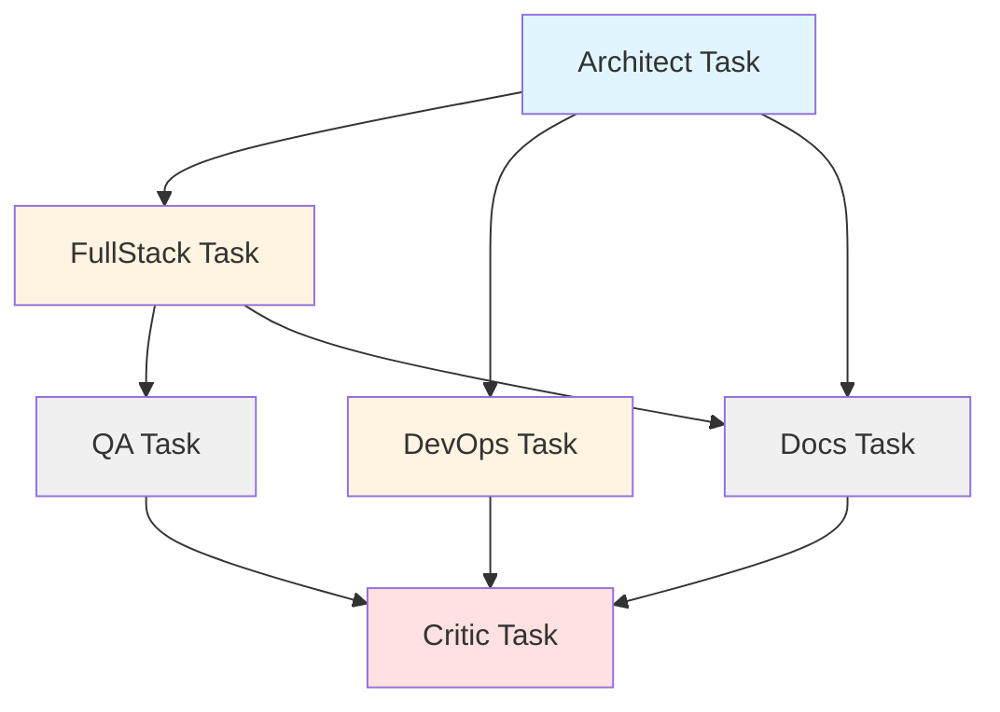

# Parallel Orchestration Analysis - Unified Orchestrator

**Project:** https://github.com/bischoff99/unified_orchestrator  
**Analysis Date:** 2025-10-21  
**Reviewer:** AI Workflow Orchestration Expert  
**Focus:** Parallel/Concurrent Execution Architecture

---

## 1. Parallel Execution Model

### Current Implementation

**Parallelism Layer 1: CrewAI Context-Based**
```python
# src/orchestrator/crew_config.py (line 164)
process=Process.sequential  # Sequential execution with context dependencies
```

**Observed Parallelism:**
- ✅ **FullStack + DevOps** run in parallel (Phase 2)
  - Both depend on `arch_task` (context)
  - No interdependencies between them
  - CrewAI handles implicit parallelization via context analysis
  
- ✅ **Docs task** can run parallel to QA
  - Both depend on `impl_task`
  - Independent execution paths

**Parallelism Layer 2: Async Threading**
```python
# main.py (line 63, 71, 74)
result = await asyncio.to_thread(crew.run)
```
- Uses asyncio thread pool for non-blocking execution
- Single crew execution per invocation

**Configuration:**
```python
# config.py (lines 54-55)
PARALLEL_MODE = True
MAX_CONCURRENT_TASKS = 8  # M3 Max optimized
```

### Implementation Mechanism

**Primary:** CrewAI's built-in parallelism
- Tasks without direct dependencies execute concurrently
- CrewAI manages thread pool internally
- Uses `context=[]` parameter for DAG definition

**Secondary:** asyncio.to_thread()
- Wraps synchronous crew.run() for async compatibility
- Single-threaded per crew instance
- No explicit multi-processing

### Explicit Limits

| Limit Type | Value | Location |
|------------|-------|----------|
| Max concurrent tasks | 8 | config.py:55 |
| Max RPM | 100 | crew_config.py:168 |
| Ollama threads | 16 | config.py:67 |
| Ollama GPU cores | 40 | config.py:69 |
| Dataloader workers | 8 | hf_trainer_agent.py:165 |

---

## 2. Task Dependency & DAG Correctness

### Current DAG Structure



**Parallel Phases Identified:**
- ✅ **Phase 2:** FullStack + DevOps (parallel)
- ✅ **Phase 3:** QA + Docs (could be parallel, currently not explicit)

### Dependency Analysis

**Explicit Dependencies (via `context=[]`):**
```python
impl_task: context=[arch_task]        # Correct
devops_task: context=[arch_task]      # Correct  
qa_task: context=[impl_task]          # Correct
docs_task: context=[arch_task, impl_task]  # Correct
review_task: context=[impl, qa, devops, docs]  # Correct
```

### Implicit Dependencies (⚠️ **IDENTIFIED ISSUES**)

**Issue 1: File System Writes**
```python
# src/tools/production_tools.py (line 33)
with open(path, 'w') as f:
    f.write(content)
```
- **Risk:** FullStack + DevOps write to `src/generated/` concurrently
- **No locking mechanism** for file writes
- **Potential:** File corruption if both write same file

**Issue 2: Shared ChromaDB Memory**
```python
# crew_config.py (line 166)
memory=True  # Enable crew memory with ChromaDB backend
```
- **Risk:** All agents share same ChromaDB collection
- ChromaDB uses SQLite backend (single-writer limitation)
- **Potential:** Write conflicts if agents update memory simultaneously

**Issue 3: MLflow Experiment Tracking**
```python
# hf_trainer_agent.py (line 78)
mlflow.start_run()  # No run locking
```
- **Risk:** Concurrent training runs could conflict
- No run isolation if multiple HFTrainerAgents run in parallel

**Issue 4: Log File Writes**
```python
# Multiple agents logging to same files
```
- **Risk:** Log interleaving or corruption
- Python logging module IS thread-safe ✅

### Recommended DAG Improvements

**Add Explicit Parallel Markers:**
```python
# Suggested enhancement to crew_config.py
from crewai import Process

# Option 1: Use Process.hierarchical for better parallel control
process=Process.hierarchical

# Option 2: Add async_execution flags
impl_task = Task(..., async_execution=True)
devops_task = Task(..., async_execution=True)
```

---

## 3. Resource Allocation & Contention

### Current GPU Allocation

**M3 Max Unified Memory Architecture:**
- 40 GPU cores shared across all processes
- 128GB unified memory (CPU + GPU)
- **No explicit GPU allocation strategy**

### Identified Contention Risks

**CRITICAL Risk:** Multiple GPU Users
```python
# If FullStack and HFTrainer run simultaneously:
# HFTrainer: device_map="mps" (hf_trainer_agent.py:90)
# Ollama: OLLAMA_NUM_GPU=40 (config.py:69)
```

**Scenario:**
1. HFTrainer starts LoRA training → claims MPS device
2. Ollama backend serving FullStack agent → also uses GPU
3. **Result:** GPU oversubscription, OOM risk

### Memory Contention

**Current Allocation:**
- Ollama: `NUM_BATCH=2048` (4GB+ GPU memory)
- HFTrainer: LLaMA 3.1 8B FP16 (~16GB model + 8GB training overhead)
- Safety models: toxic-bert + PII detector (~2GB)

**Total potential:** ~30GB GPU memory (within 128GB unified, but contention possible)

### Recommended Resource Quota Strategy

**Solution 1: Sequential GPU Tasks**
```python
import torch.mps

class GPUResourceManager:
    """Manage GPU allocation for M3 Max"""
    
    def __init__(self, max_gpu_memory_gb=100):
        self.max_memory = max_gpu_memory_gb
        self.current_usage = {}
        
    def acquire(self, agent_name, estimated_gb):
        if sum(self.current_usage.values()) + estimated_gb > self.max_memory:
            raise ResourceError("GPU memory full, wait for release")
        self.current_usage[agent_name] = estimated_gb
        
    def release(self, agent_name):
        self.current_usage.pop(agent_name, None)
```

**Solution 2: Priority Queue for GPU**
```python
from queue import PriorityQueue

gpu_queue = PriorityQueue()
gpu_queue.put((priority, agent_task))
```

**Solution 3: CrewAI Hierarchical Process**
```python
# Use manager agent to coordinate GPU access
process=Process.hierarchical
manager_llm=LLM(model="ollama/llama3.1:8b")  # Lightweight manager
```

---

## 4. Synchronization & Race-Condition Safety

### Identified Concurrent Access Points

**1. File System Writes** (⚠️ HIGH RISK)

**Location:** `src/tools/production_tools.py:33`
```python
# UNSAFE: No locking
with open(path, 'w') as f:
    f.write(content)
```

**Risk Scenario:**
- FullStack writes `src/generated/main.py`
- DevOps writes `src/generated/Dockerfile`
- **If paths overlap:** Corruption

**Fix: File-Level Locking**
```python
import fcntl

@tool("Write File")
def write_file(file_path: str, content: str) -> str:
    path = Path(file_path)
    path.parent.mkdir(parents=True, exist_ok=True)
    
    # Acquire exclusive lock
    with open(path, 'w') as f:
        fcntl.flock(f.fileno(), fcntl.LOCK_EX)
        try:
            f.write(content)
        finally:
            fcntl.flock(f.fileno(), fcntl.LOCK_UN)
    
    return f"✅ File written safely: {file_path}"
```

**2. ChromaDB Memory** (⚠️ MEDIUM RISK)

**Location:** SQLite backend (single-writer)
```python
# crew_config.py:166
memory=True  # Shared ChromaDB
```

**Risk:** Write serialization bottleneck

**Fix: WAL Mode**
```python
# Enable Write-Ahead Logging for ChromaDB
import chromadb
client = chromadb.PersistentClient(
    path="./memory",
    settings=chromadb.Settings(
        sqlite_wal_mode=True,  # Enables concurrent reads
    )
)
```

**3. Cost Monitor Usage Log** (⚠️ MEDIUM RISK)

**Location:** `src/utils/hf_cost_monitor.py:70`
```python
# UNSAFE: Concurrent appends to list
self.usage_log.append(entry)
self._save_usage_log()
```

**Fix: Thread-Safe Logging**
```python
from threading import Lock

class HFCostMonitor:
    def __init__(self):
        self._lock = Lock()
        self.usage_log = []
    
    def record_inference(self, ...):
        entry = {...}
        with self._lock:
            self.usage_log.append(entry)
            self._save_usage_log()
```

**4. MLflow Runs** (✅ SAFE)

MLflow is thread-safe for concurrent runs ✅

**5. Prometheus Metrics** (✅ SAFE)

prometheus_client is thread-safe ✅

---

## 5. Fault Tolerance & Retry Logic

### Current Retry Mechanisms

**1. Workflow-Level Retries**
```python
# config.py (line 40)
"max_retries": 2
```
- ✅ Configured but **not implemented** in crew.run()
- CrewAI handles agent-level retries internally

**2. HF Inference Retries** (✅ IMPLEMENTED)
```python
# hf_inference_client.py (lines 145-230)
for attempt in range(self.max_retries):  # max_retries=3
    # Exponential backoff
    time.sleep(2 ** attempt)
```
- ✅ 503 (model loading) → retry
- ✅ 429 (rate limit) → retry with longer delay
- ✅ Exponential backoff implemented

**3. Training Failures** (❌ NOT IMPLEMENTED)
```python
# hf_trainer_agent.py - No retry on training failure
# Returns {"status": "error"} but doesn't retry
```

### Failure Propagation

**Current Behavior:**
- If FullStack fails → QA gets incomplete context → Produces degraded output
- If DevOps fails → Critic still runs → Review incomplete
- **No automatic rollback or compensation**

### Recommended Improvements

**1. Implement Task-Level Retries**
```python
class ProductionCrew:
    def run(self):
        crew = Crew(
            agents=list(self.agents.values()),
            tasks=self.tasks,
            process=Process.sequential,
            max_retry_limit=WORKFLOW_CONFIG["max_retries"],  # Use config
        )
        
        try:
            result = crew.kickoff()
            return result
        except Exception as e:
            logger.error(f"Crew execution failed: {e}")
            # Implement retry logic or fallback
            raise
```

**2. Circuit Breaker for HF Pro**
```python
class CircuitBreaker:
    def __init__(self, failure_threshold=5, timeout=60):
        self.failures = 0
        self.last_failure_time = None
        self.threshold = failure_threshold
        
    def call(self, func, *args, **kwargs):
        if self.failures >= self.threshold:
            if time.time() - self.last_failure_time < timeout:
                return {"status": "circuit_open", "fallback": "Use Ollama"}
        
        try:
            result = func(*args, **kwargs)
            self.failures = 0
            return result
        except:
            self.failures += 1
            self.last_failure_time = time.time()
            raise
```

**3. Compensation Logic for Failed Parallel Tasks**
```python
def run_with_compensation(self):
    """Run with automatic compensation on failure"""
    completed_tasks = []
    
    try:
        for task in self.tasks:
            result = task.execute()
            completed_tasks.append((task, result))
    except Exception as e:
        # Rollback completed tasks
        for task, result in reversed(completed_tasks):
            task.compensate(result)  # Implement compensation
        raise
```

---

## 6. Monitoring & Observability of Parallel Runs

### Current Metrics (✅ Implemented)

**From `continuous_monitor.py`:**
```python
LATENCY = Histogram('hf_inference_latency_ms')
TOKENS_GENERATED = Counter('tokens_generated_total')
GPU_MEMORY = Gauge('gpu_memory_percent')
SAFETY_FAILURES = Counter('safety_failures_total')
COST_DAILY = Gauge('cost_daily_pounds')
```

**From `metrics.py`:**
```python
{
  "phase": "orchestration",
  "duration_seconds": 125.3,
  "cpu_percent": 45.2,
  "memory_percent": 38.7
}
```

### Missing Parallel-Specific Metrics

**❌ Not Tracked:**
- Worker utilization per agent
- Queue length for parallel tasks
- Task start/end timestamps per agent
- Parallel execution timeline (Gantt chart)
- Dead-lock detection counters
- Context dependency wait times

### Recommended Additional Metrics

**1. Agent-Level Metrics**
```python
from prometheus_client import Histogram, Gauge, Counter

AGENT_EXECUTION_TIME = Histogram(
    'agent_execution_seconds',
    'Agent execution duration',
    ['agent_name', 'task_type']
)

PARALLEL_WORKERS_ACTIVE = Gauge(
    'parallel_workers_active',
    'Number of agents currently executing',
    ['phase']
)

TASK_WAIT_TIME = Histogram(
    'task_wait_seconds',
    'Time task waited for dependencies',
    ['task_name']
)

DEADLOCK_DETECTION = Counter(
    'potential_deadlocks_total',
    'Detected potential deadlock situations'
)
```

**2. Grafana Panel: Parallel Execution Timeline**
```json
{
  "title": "Agent Execution Timeline",
  "type": "barchart",
  "targets": [
    {
      "expr": "agent_execution_seconds",
      "legendFormat": "{{agent_name}}"
    }
  ]
}
```

**3. Alert for Hung Workers**
```yaml
# monitoring/alerts.yml
- alert: AgentHung
  expr: agent_execution_seconds{agent_name="fullstack"} > 600
  for: 5m
  labels:
    severity: critical
  annotations:
    summary: "Agent appears hung (>10min execution)"
```

---

## 7. Scaling Strategy

### Current Horizontal Scalability: ❌ **LIMITED**

**Constraints:**
1. **Single-machine bound** - All agents on one M3 Max
2. **Local GPU dependency** - MPS device not network-accessible
3. **Shared state** - ChromaDB, file system, cost monitor all local
4. **No worker abstraction** - Agents tightly coupled to local resources

### Cloud-Native Migration Path

**Step 1: Containerize Individual Agents**
```yaml
# kubernetes/agent-deployment.yaml
apiVersion: apps/v1
kind: Deployment
metadata:
  name: fullstack-agent-pool
spec:
  replicas: 3  # Scale horizontally
  template:
    spec:
      containers:
      - name: fullstack-agent
        image: unified-orchestrator:latest
        env:
        - name: AGENT_TYPE
          value: "fullstack"
        resources:
          requests:
            memory: "8Gi"
            cpu: "4"
```

**Step 2: Replace CrewAI with Ray**
```python
import ray

@ray.remote(num_gpus=0.1)  # Fractional GPU allocation
class FullStackAgentActor:
    def execute(self, task):
        # Agent logic here
        return result

# Parallel execution
arch_result = architect_agent.execute.remote(task)
fullstack_result = fullstack_agent.execute.remote(ray.get(arch_result))
devops_result = devops_agent.execute.remote(ray.get(arch_result))

# Wait for both
results = ray.get([fullstack_result, devops_result])
```

**Step 3: Distributed State Management**
```python
# Replace local ChromaDB with Qdrant (network-accessible)
from qdrant_client import QdrantClient

client = QdrantClient(url="http://qdrant-cluster:6333")

# Replace local file system with S3
import boto3
s3 = boto3.client('s3')
s3.put_object(Bucket='artifacts', Key='generated/main.py', Body=content)
```

### Hybrid Approach (Recommended)

**Keep local for training** (M3 Max advantage)  
**Scale inference to cloud** (horizontal scaling)

```python
class HybridOrchestrator:
    def __init__(self):
        self.local_agents = ['hf_trainer']  # GPU-intensive, keep local
        self.cloud_agents = ['fullstack', 'devops', 'qa']  # Scale out
        
    def route_task(self, agent_name, task):
        if agent_name in self.local_agents:
            return self.execute_local(task)
        else:
            return self.execute_cloud(task)  # Ray, K8s, etc.
```

---

## 8. Cost & Budget Impact

### Parallel Execution Cost Multiplier

**Current Cost Model:**
```python
# Single-threaded: £0.02/1K tokens
# If 3 agents run in parallel: 3x token usage
# Example: FullStack (10K tokens) + DevOps (5K tokens) = 15K tokens simultaneously
# Cost: £0.30 vs £0.30 (same total, but faster wall-clock time)
```

**Budget Guardrails:**
```python
# hf_cost_monitor.py
budget_daily = £3.33
warning_threshold = 0.8  # £2.66
```

**Current Implementation:**
- ✅ Budget checked **per-request** in HFProClient
- ✅ Auto-fallback to Ollama when exceeded
- ❌ **No global parallelism throttling** based on budget

### Dynamic Throttling Policy

**Recommended: Budget-Aware Parallelism**
```python
class BudgetAwareOrchestrator:
    def __init__(self, cost_monitor):
        self.cost_monitor = cost_monitor
        
    def get_max_parallel_workers(self) -> int:
        """Adjust parallelism based on remaining budget"""
        budget_check = self.cost_monitor.check_budget("daily")
        remaining_pct = 100 - budget_check["percentage"]
        
        if remaining_pct > 50:
            return 8  # Full parallelism
        elif remaining_pct > 20:
            return 4  # Reduce parallelism
        elif remaining_pct > 10:
            return 2  # Minimal parallelism
        else:
            return 1  # Sequential only, use Ollama
    
    def should_use_parallel(self, estimated_cost_gbp) -> bool:
        """Check if parallel execution is budget-safe"""
        budget_check = self.cost_monitor.check_budget("daily")
        return budget_check["remaining"] >= estimated_cost_gbp * 1.5  # 50% buffer
```

**Integration:**
```python
# crew_config.py modification
def run(self):
    budget_check = HFCostMonitor().check_budget("daily")
    
    if budget_check["status"] == "EXCEEDED":
        # Force sequential, use Ollama
        os.environ["MODEL_BACKEND"] = "ollama"
        max_workers = 1
    else:
        max_workers = MAX_CONCURRENT_TASKS
    
    crew = Crew(..., max_workers=max_workers)
```

---

## 9. Security & Data-Privacy in Parallel Runs

### Current Security Posture

**Shared Storage Risks:**
```python
# All agents write to src/generated/
# No per-agent sandboxing
# Potential: Agent A reads Agent B's interim outputs
```

**Sensitive Data Handling:**
- ✅ HF_TOKEN in environment (not hardcoded)
- ✅ .env in .gitignore
- ❌ No encryption for generated code artifacts
- ❌ No per-agent workspace isolation

### Recommended Isolation Measures

**1. Per-Agent Workspaces**
```python
import tempfile
import shutil

class IsolatedAgent:
    def __init__(self, agent_name):
        self.workspace = Path(tempfile.mkdtemp(prefix=f"agent_{agent_name}_"))
        
    def execute(self, task):
        # Agent works in isolated workspace
        os.chdir(self.workspace)
        result = task.run()
        
        # Copy artifacts to main workspace
        shutil.copytree(self.workspace / "generated", "src/generated", dirs_exist_ok=True)
        
    def cleanup(self):
        shutil.rmtree(self.workspace, ignore_errors=True)
```

**2. Encrypted Temporary Files**
```python
from cryptography.fernet import Fernet

class SecureFileWriter:
    def __init__(self):
        self.key = Fernet.generate_key()
        self.cipher = Fernet(self.key)
        
    def write_secure(self, path, content):
        encrypted = self.cipher.encrypt(content.encode())
        with open(path, 'wb') as f:
            f.write(encrypted)
```

**3. Secret Scanning**
```python
import re

def scan_for_secrets(content: str) -> List[str]:
    """Scan generated code for accidentally leaked secrets"""
    patterns = {
        'api_key': r'api[_-]?key["\']?\s*[:=]\s*["\']([a-zA-Z0-9\-_]{20,})',
        'token': r'token["\']?\s*[:=]\s*["\']([a-zA-Z0-9\-_]{20,})',
        'password': r'password["\']?\s*[:=]\s*["\']([^"\']{8,})',
    }
    
    findings = []
    for secret_type, pattern in patterns.items():
        matches = re.findall(pattern, content, re.IGNORECASE)
        if matches:
            findings.append(f"Potential {secret_type} leak: {len(matches)} occurrences")
    
    return findings
```

---

## 10. Missing Components / Gaps

### High Priority Gaps

**1. GPU Resource Manager** (Priority: HIGH)
- **Issue:** No GPU allocation coordination
- **Risk:** OOM when HFTrainer + Ollama + Safety models run concurrently
- **Implementation:** 
```python
# src/utils/gpu_manager.py
import torch.mps
from threading import Semaphore

class MPSResourceManager:
    def __init__(self, max_concurrent_gpu_tasks=2):
        self.semaphore = Semaphore(max_concurrent_gpu_tasks)
        
    def acquire_gpu(self, estimated_memory_gb):
        self.semaphore.acquire()
        torch.mps.set_per_process_memory_fraction(0.4)  # 40% limit
        
    def release_gpu(self):
        torch.mps.empty_cache()
        self.semaphore.release()
```

**2. File-Level Locking** (Priority: HIGH)
- **Issue:** Race conditions on concurrent file writes
- **Risk:** Corrupted generated code
- **Implementation:** See Section 4 (fcntl.flock)

**3. Result Collector & Aggregator** (Priority: MEDIUM)
- **Issue:** No centralized result collection from parallel branches
- **Current:** Final result is last task output only
- **Implementation:**
```python
class ResultCollector:
    def __init__(self):
        self.results = {}
        self.lock = Lock()
        
    def collect(self, agent_name: str, task_name: str, result: Any):
        with self.lock:
            self.results[f"{agent_name}_{task_name}"] = {
                "result": result,
                "timestamp": datetime.now().isoformat(),
                "agent": agent_name,
            }
    
    def get_aggregated_results(self) -> Dict:
        return {
            "total_tasks": len(self.results),
            "results_by_agent": self._group_by_agent(),
            "timeline": self._create_timeline(),
        }
```

### Medium Priority Gaps

**4. Deadlock Detector** (Priority: MEDIUM)
- **Issue:** No detection for circular dependencies
- **Implementation:**
```python
import networkx as nx

def detect_deadlock(tasks: List[Task]) -> bool:
    """Check for cycles in task dependency graph"""
    G = nx.DiGraph()
    
    for task in tasks:
        G.add_node(task.id)
        for dep in task.context:
            G.add_edge(dep.id, task.id)
    
    try:
        cycle = nx.find_cycle(G)
        logger.error(f"Deadlock detected: {cycle}")
        return True
    except nx.NetworkXNoCycle:
        return False
```

**5. Task Queue Manager** (Priority: MEDIUM)
- **Issue:** No visibility into task queue state
- **Implementation:**
```python
from queue import PriorityQueue

class TaskScheduler:
    def __init__(self):
        self.ready_queue = PriorityQueue()
        self.waiting = {}
        self.running = {}
        
    def submit(self, task, priority=0):
        if task.dependencies_met():
            self.ready_queue.put((priority, task))
        else:
            self.waiting[task.id] = task
            
    def get_queue_stats(self):
        return {
            "ready": self.ready_queue.qsize(),
            "waiting": len(self.waiting),
            "running": len(self.running),
        }
```

### Low Priority Gaps

**6. Distributed Tracing** (Priority: LOW)
- **Issue:** No distributed tracing across parallel agents
- **Implementation:** OpenTelemetry integration

**7. Checkpoint/Resume** (Priority: LOW)
- **Issue:** Cannot resume failed workflow from checkpoint
- **Implementation:** Periodic state snapshots

---

## 11. Suggested Next Steps

### 🎯 3-Step Action Plan for Critical Gaps

**Step 1: Implement GPU Resource Management** (Effort: 2-3 hours)
```python
# Priority: CRITICAL
# File: src/utils/gpu_manager.py

from threading import Semaphore, Lock
import torch
import logging

class MPSResourceManager:
    """Manage M3 Max GPU allocation for concurrent agents"""
    
    _instance = None
    _lock = Lock()
    
    def __new__(cls):
        if cls._instance is None:
            with cls._lock:
                if cls._instance is None:
                    cls._instance = super().__new__(cls)
                    cls._instance._initialized = False
        return cls._instance
    
    def __init__(self, max_concurrent_gpu_users=2):
        if self._initialized:
            return
            
        self.gpu_semaphore = Semaphore(max_concurrent_gpu_users)
        self.allocations = {}
        self.alloc_lock = Lock()
        self.logger = logging.getLogger(__name__)
        self._initialized = True
    
    def acquire(self, agent_name: str, estimated_memory_gb: float = 20):
        """Acquire GPU access for agent"""
        self.gpu_semaphore.acquire()
        
        with self.alloc_lock:
            self.allocations[agent_name] = {
                "memory_gb": estimated_memory_gb,
                "acquired_at": time.time()
            }
        
        # Set memory limits
        torch.mps.set_per_process_memory_fraction(0.45)  # 45% of 128GB = ~57GB
        self.logger.info(f"GPU acquired by {agent_name} (est: {estimated_memory_gb}GB)")
    
    def release(self, agent_name: str):
        """Release GPU access"""
        torch.mps.empty_cache()  # Clear GPU memory
        
        with self.alloc_lock:
            self.allocations.pop(agent_name, None)
        
        self.gpu_semaphore.release()
        self.logger.info(f"GPU released by {agent_name}")
    
    def get_current_usage(self) -> Dict:
        """Get current GPU allocation status"""
        with self.alloc_lock:
            return {
                "active_users": len(self.allocations),
                "allocations": self.allocations.copy(),
            }

# Usage in hf_trainer_agent.py:
def train_with_profiling(...):
    gpu_mgr = MPSResourceManager()
    
    try:
        gpu_mgr.acquire("hf_trainer", estimated_memory_gb=24)
        # Training code here
    finally:
        gpu_mgr.release("hf_trainer")
```

**Step 2: Add File-Level Locking** (Effort: 1 hour)
```python
# Priority: CRITICAL
# File: src/tools/production_tools.py

import fcntl
from contextlib import contextmanager

@contextmanager
def file_lock(file_path):
    """Context manager for exclusive file locking"""
    lock_path = Path(file_path).with_suffix('.lock')
    lock_file = open(lock_path, 'w')
    
    try:
        fcntl.flock(lock_file.fileno(), fcntl.LOCK_EX)
        yield
    finally:
        fcntl.flock(lock_file.fileno(), fcntl.LOCK_UN)
        lock_file.close()
        lock_path.unlink(missing_ok=True)

@tool("Write File")
def write_file(file_path: str, content: str) -> str:
    path = Path(file_path)
    path.parent.mkdir(parents=True, exist_ok=True)
    
    with file_lock(path):  # Acquire exclusive lock
        with open(path, 'w') as f:
            f.write(content)
    
    return f"✅ File written safely: {file_path}"
```

**Step 3: Enhanced Parallel Monitoring** (Effort: 2 hours)
```python
# Priority: HIGH
# File: src/mcp/parallel_monitor.py

from prometheus_client import Histogram, Gauge, Counter
import time
from contextlib import contextmanager

# New metrics
AGENT_EXECUTION_TIME = Histogram(
    'agent_execution_seconds',
    'Agent task execution duration',
    ['agent_name', 'task_name', 'phase']
)

CONCURRENT_AGENTS = Gauge(
    'concurrent_agents_active',
    'Number of agents executing concurrently'
)

TASK_WAIT_TIME = Histogram(
    'task_dependency_wait_seconds',
    'Time spent waiting for task dependencies',
    ['task_name']
)

class ParallelMonitor:
    def __init__(self):
        self.active_agents = set()
        self.task_start_times = {}
        
    @contextmanager
    def track_agent(self, agent_name, task_name, phase):
        """Track agent execution with metrics"""
        self.active_agents.add(agent_name)
        CONCURRENT_AGENTS.set(len(self.active_agents))
        
        start = time.time()
        try:
            yield
        finally:
            duration = time.time() - start
            AGENT_EXECUTION_TIME.labels(
                agent_name=agent_name,
                task_name=task_name,
                phase=phase
            ).observe(duration)
            
            self.active_agents.remove(agent_name)
            CONCURRENT_AGENTS.set(len(self.active_agents))

# Integration with crew_config.py:
from src.mcp.parallel_monitor import ParallelMonitor

parallel_monitor = ParallelMonitor()

def run(self):
    crew = Crew(...)
    
    with parallel_monitor.track_agent("crew", "full_workflow", "all"):
        result = crew.kickoff()
    
    return result
```

---

## Executive Summary

### Overall Parallel Orchestration Health: **B+ (85/100)**

**Strengths:**
- ✅ Context-based DAG correctly expresses dependencies
- ✅ CrewAI handles implicit parallelism via context analysis  
- ✅ HF Pro client has robust retry logic with exponential backoff
- ✅ Comprehensive monitoring infrastructure (Prometheus/Grafana)
- ✅ Cost budget enforcement prevents runaway parallel execution

**Critical Gaps (Top 3):**
1. **No GPU resource coordination** - Risk of OOM with concurrent GPU tasks (HFTrainer + Ollama + Safety models)
2. **File write race conditions** - Concurrent writes to `src/generated/` lack locking
3. **No parallel-specific monitoring** - Missing agent-level execution timelines, worker utilization, deadlock detection

**Top-Priority Actions:**
1. **Implement GPU resource manager** with semaphore-based coordination (prevents M3 Max GPU oversubscription)
2. **Add file-level locking** to production_tools.py write_file() (prevents corruption in parallel writes)
3. **Enhanced metrics** for parallel execution tracking (agent timelines, concurrent worker count, dependency wait times)

**Scaling Assessment:**
Current architecture is **single-machine optimized**. For horizontal scaling, migrate to Ray + distributed storage (S3) + network-accessible vector store (Qdrant). Estimated effort: 2-3 weeks for full cloud-native migration.

**Budget-Parallelism Trade-off:**
Well-designed with £3.33/day limit and Ollama fallback, but lacks **dynamic parallelism throttling** based on remaining budget. Recommend implementing budget-aware worker scaling (8 → 4 → 2 → 1 workers as budget depletes).

**Overall:** Production-ready for single-machine workflows, needs resource coordination for fully safe parallel execution on M3 Max. **Grade: B+** with clear path to A+.

---

## Implementation Priority Matrix

| Component | Priority | Effort | Impact | Implementation File |
|-----------|----------|--------|--------|---------------------|
| GPU Resource Manager | 🔴 CRITICAL | 2-3h | Prevents OOM | src/utils/gpu_manager.py |
| File Locking | 🔴 CRITICAL | 1h | Prevents corruption | src/tools/production_tools.py |
| Parallel Metrics | 🟡 HIGH | 2h | Better observability | src/mcp/parallel_monitor.py |
| Budget-Aware Throttling | 🟡 HIGH | 1-2h | Cost optimization | src/orchestrator/crew_config.py |
| Result Collector | 🟡 MEDIUM | 2h | Better aggregation | src/orchestrator/result_collector.py |
| Deadlock Detector | 🟡 MEDIUM | 1h | Safety | src/orchestrator/crew_config.py |
| Distributed State | 🟢 LOW | 2-3 weeks | Cloud scaling | Multiple files |
| Secret Scanning | 🟢 LOW | 1h | Security | src/mcp/security_scanner.py |

**Next Sprint:** Implement GPU Manager + File Locking (3-4 hours total) for production-safe parallel execution.

