# Master Workflow Orchestration - Complete Multi-Client Integration

**Status:** 🎯 Comprehensive Workflow Mapped  
**Created:** October 22, 2025  
**Clients:** Cursor IDE + Claude Desktop + Perplexity Desktop

---

## 🌟 Executive Summary

A fully automated development pipeline leveraging three AI-powered clients, each contributing their unique strengths:
- **Perplexity Desktop**: Research, Planning, External Integrations
- **Claude Desktop**: Coordination, Automation, Cross-App Control
- **Cursor IDE**: Development, Testing, Code Generation

**One Command** → **Complete Feature** (Research to Deployment)

---

## 📊 Complete Workflow Architecture

```mermaid
graph TB
    Start["🎯 User Request:<br/>'Generate new feature: {description}'"]
    
    subgraph "Phase 1: RESEARCH [Perplexity Desktop]"
        R1[Query Space for patterns]
        R2[Web research for best practices]
        R3[Save to filesystem MCP]
        R4[Create Notion research page]
        R5[Create Linear epic]
    end
    
    subgraph "Phase 2: PLANNING [Claude + Perplexity]"
        P1[Claude reads research files]
        P2[Claude creates tech spec]
        P3[Save spec to ChromaDB]
        P4[Perplexity creates Linear tasks]
        P5[Update Notion with architecture]
    end
    
    subgraph "Phase 3: DEVELOPMENT [Cursor IDE]"
        D1[Agent Mode reads spec]
        D2[Generate multi-file code]
        D3[HuggingFace custom models]
        D4[Create tests with Browser]
        D5[Save patterns to Supermemory]
    end
    
    subgraph "Phase 4: TESTING [All Clients]"
        T1[Cursor runs unit tests]
        T2[Cursor Browser integration tests]
        T3[Claude chrome-control E2E tests]
        T4[Perplexity checks known issues]
        T5[Aggregate results in ChromaDB]
    end
    
    subgraph "Phase 5: DEPLOYMENT [Claude Coordinating]"
        DEP1[Cursor commits code]
        DEP2[Perplexity creates PR]
        DEP3[Claude runs deploy scripts]
        DEP4[Perplexity notifies Slack]
        DEP5[Update deployment status]
    end
    
    subgraph "Phase 6: DOCUMENTATION [All Clients]"
        DOC1[Perplexity creates Notion docs]
        DOC2[Cursor generates code docs]
        DOC3[Claude documents decisions]
        DOC4[Update Space with learnings]
        DOC5[Cross-link all resources]
    end
    
    Start --> R1
    R5 --> P1
    P5 --> D1
    D5 --> T1
    T5 -->|Tests Pass| DEP1
    T5 -->|Tests Fail| D1
    DEP5 --> DOC1
    DOC5 --> End["✅ Complete Feature Delivered"]
```



---

## 🔄 Phase 1: Research (Perplexity Desktop)

### **Trigger**
```
In Perplexity Desktop:
"Research and plan: [FEATURE DESCRIPTION]"
```

### **Actions**
```yaml
1_query_space:
  tool: Space MCP Connector
  action: Query "agentic-workflow-orchestration"
  query: "patterns for {feature_type}"
  output: relevant_patterns.md

2_web_research:
  tool: Perplexity Search
  action: Search latest best practices
  topics:
    - "{feature} implementation 2025"
    - "{feature} architecture patterns"
    - "{feature} common pitfalls"
  output: web_research.md

3_save_research:
  tool: Filesystem MCP
  action: Write files
  location: /unified_orchestrator/research/
  files:
    - "{timestamp}_patterns.md"
    - "{timestamp}_best_practices.md"
    - "{timestamp}_research_summary.md"

4_create_notion:
  tool: Notion MCP
  action: Create page
  database: "Research & Planning"
  title: "{feature} Research - {date}"
  content: Combined research findings
  output: notion_url

5_create_epic:
  tool: Linear MCP
  action: Create epic
  title: "Implement {feature}"
  description: Research summary + Notion link
  labels: ["ai-generated", "research-complete"]
  output: epic_id
```

### **Outputs**
- Research files in `/research/`
- Notion page URL
- Linear epic ID
- Research summary in ChromaDB

---

## 🔄 Phase 2: Planning (Claude Desktop + Perplexity)

### **Trigger**
```applescript
-- Claude Desktop receives handoff via OSAScript
tell application "Claude"
    activate
    -- Notification: "Research complete. Epic ID: {epic_id}"
end tell
```

### **Actions**
```yaml
1_read_research:
  client: Claude Desktop
  tool: Desktop Commander MCP
  action: Read research files
  command: "ls research/*.md | xargs cat"
  
2_analyze_spec:
  client: Claude Desktop
  tool: Sequential Thinking MCP
  action: Create technical specification
  steps:
    - Analyze research findings
    - Define system architecture
    - List required components
    - Specify interfaces
    - Create implementation plan
  
3_save_to_chroma:
  client: Claude Desktop
  tool: Chroma MCP
  action: Store specification
  collection: "specifications"
  document:
    id: "{epic_id}_spec"
    content: technical_specification
    metadata:
      epic_id: "{epic_id}"
      feature: "{feature_name}"
      timestamp: "{timestamp}"
      
4_create_tasks:
  client: Claude Desktop → Perplexity
  tool: OSAScript → Linear MCP
  action: Create sub-tasks
  script: |
    tell application "Perplexity"
      -- Create task for each component
      for component in spec.components:
        create_linear_task(component)
    end tell
    
5_update_notion:
  client: Perplexity Desktop  
  tool: Notion MCP
  action: Update research page
  add:
    - Technical specification
    - Architecture diagram
    - Task breakdown
    - Implementation timeline
```

### **Outputs**
- Technical specification document
- ChromaDB specification entry
- Linear sub-tasks created
- Updated Notion page

---

## 🔄 Phase 3: Development (Cursor IDE)

### **Trigger**
```python
# Cursor Agent Mode activated via AppleScript
osascript -e 'tell application "Cursor" to activate'
osascript -e 'tell application "System Events" to keystroke "l" using command down'
```

### **Actions**
```yaml
1_retrieve_spec:
  client: Cursor IDE
  tool: Chroma MCP
  action: Query specification
  collection: "specifications"
  query: "epic_id:{epic_id}"
  
2_agent_generation:
  client: Cursor IDE
  mode: Agent Mode
  prompt: |
    Generate complete implementation for:
    {specification}
    
    Requirements:
    - Follow project patterns from ChromaDB
    - Use DAG architecture
    - Include comprehensive tests
    - Add proper error handling
    
3_multi_file_creation:
  client: Cursor IDE
  mode: Composer
  action: Create multiple files
  files:
    - "src/features/{feature}/__init__.py"
    - "src/features/{feature}/models.py"
    - "src/features/{feature}/services.py"
    - "src/features/{feature}/api.py"
    - "tests/test_{feature}.py"
    
4_specialized_generation:
  client: Cursor IDE
  tool: HuggingFace MCP
  models:
    - Code review model
    - Documentation generator
    - Test case generator
  
5_browser_testing:
  client: Cursor IDE
  tool: Built-in Browser (Playwright)
  action: Create visual tests
  tests:
    - UI component testing
    - API endpoint testing
    - Integration scenarios
    
6_pattern_memory:
  client: Cursor IDE
  tool: Supermemory MCP
  action: Store patterns
  entries:
    - Implementation decisions
    - Code patterns used
    - Test strategies
    - Performance optimizations
```

### **Outputs**
- Generated source code
- Test files
- Browser test recordings
- Supermemory pattern entries

---

## 🔄 Phase 4: Testing (All Clients)

### **Trigger**
```bash
# Desktop Commander initiates test suite
python -m pytest tests/test_{feature}.py -v
```

### **Actions**
```yaml
1_unit_tests:
  client: Cursor IDE
  tool: Desktop Commander MCP
  commands:
    - "pytest tests/unit/"
    - "python -m coverage run"
    - "python -m coverage report"
  
2_integration_tests:
  client: Cursor IDE
  tool: Cursor Browser
  action: Run Playwright tests
  tests:
    - API integration tests
    - UI component tests
    - End-to-end workflows
    
3_browser_e2e:
  client: Claude Desktop
  tool: Chrome Control Extension
  action: Real browser testing
  scenarios:
    - User authentication flow
    - Feature functionality
    - Edge cases
    - Performance testing
    
4_known_issues_check:
  client: Perplexity Desktop
  tool: Space MCP
  action: Query known issues
  search: "similar implementation problems"
  
5_results_aggregation:
  client: Claude Desktop
  tool: Chroma MCP
  action: Store test results
  collection: "test_results"
  document:
    id: "{epic_id}_test_{timestamp}"
    results: all_test_results
    coverage: coverage_report
    issues: found_issues
    
6_linear_update:
  client: Perplexity Desktop
  tool: Linear MCP
  action: Update task status
  updates:
    - Mark tasks as tested
    - Add test results as comments
    - Link to test reports
```

### **Test Loop Logic**
```python
if all_tests_pass:
    proceed_to_deployment()
else:
    # Return to Development Phase
    cursor_agent_mode.fix_issues(test_failures)
    rerun_tests()
```

### **Outputs**
- Test execution reports
- Coverage reports
- ChromaDB test history
- Updated Linear tasks

---

## 🔄 Phase 5: Deployment (Claude Coordinating)

### **Trigger**
```applescript
-- Claude Desktop coordinates deployment
on deploy_feature(epic_id)
    -- Orchestrate all deployment steps
end deploy_feature
```

### **Actions**
```yaml
1_git_operations:
  client: Cursor IDE
  tool: Desktop Commander MCP
  commands:
    - "git add -A"
    - "git commit -m 'feat: {feature_name}'"
    - "git push origin feature/{feature_name}"
    
2_create_pr:
  client: Perplexity Desktop
  tool: GitHub MCP
  action: Create pull request
  title: "Feature: {feature_name}"
  body: |
    ## Summary
    {feature_description}
    
    ## Linear Tasks
    - Epic: {epic_url}
    - Tasks: {task_urls}
    
    ## Test Results
    - Coverage: {coverage}%
    - Tests passed: {test_count}
    
    ## Documentation
    - Notion: {notion_url}
    
3_deployment_script:
  client: Claude Desktop
  tool: Desktop Commander MCP
  script: "scripts/deploy.sh"
  environment: staging
  monitoring: enabled
  
4_deployment_checklist:
  client: Perplexity Desktop
  tool: Notion MCP
  action: Create deployment checklist
  items:
    - [ ] Code review approved
    - [ ] Tests passing
    - [ ] Documentation updated
    - [ ] Staging deployed
    - [ ] Production ready
    
5_team_notification:
  client: Perplexity Desktop
  tool: Slack MCP
  channel: "#deployments"
  message: |
    🚀 Deployment: {feature_name}
    Status: {status}
    PR: {pr_url}
    Linear: {epic_url}
    
6_rollback_ready:
  client: Claude Desktop
  tool: OSAScript
  action: Prepare rollback script
  trigger: "on_deployment_failure"
```

### **Deployment States**
```python
deployment_states = {
    "pending": "Awaiting deployment",
    "in_progress": "Deployment running",
    "success": "Successfully deployed",
    "failed": "Deployment failed - rollback initiated",
    "rolled_back": "Successfully rolled back"
}
```

### **Outputs**
- GitHub PR created and linked
- Deployment logs
- Slack notifications sent
- Notion checklist created
- Rollback script ready

---

## 🔄 Phase 6: Documentation (All Clients)

### **Trigger**
```python
# After successful deployment
if deployment_status == "success":
    trigger_documentation_phase()
```

### **Actions**
```yaml
1_notion_documentation:
  client: Perplexity Desktop
  tool: Notion MCP
  action: Create comprehensive docs
  pages:
    - API Documentation
    - User Guide
    - Architecture Overview
    - Deployment Guide
  content_from:
    - ChromaDB (specifications)
    - Linear (task details)
    - GitHub (code examples)
    
2_code_documentation:
  client: Cursor IDE
  mode: Agent Mode
  action: Generate docs
  outputs:
    - Docstrings for all functions
    - README.md for feature
    - API schema documentation
    - Example usage scripts
    
3_decision_documentation:
  client: Claude Desktop
  tool: Sequential Thinking MCP
  action: Document decisions
  topics:
    - Why this architecture?
    - Trade-offs considered
    - Performance optimizations
    - Security considerations
    
4_space_update:
  client: Perplexity Desktop
  tool: Space MCP
  action: Add learnings
  thread: "New Pattern: {feature_name}"
  content:
    - Implementation approach
    - Challenges encountered
    - Solutions found
    - Future improvements
    
5_cross_linking:
  client: All
  action: Create references
  links:
    Notion → Linear tasks
    Linear → GitHub commits
    GitHub → Notion docs
    Space → All resources
    ChromaDB → Everything
```

### **Documentation Outputs**
- Complete Notion documentation set
- Code-level documentation
- Decision log with rationale
- Updated Space with learnings
- Fully cross-referenced resources

---

## 🤖 Master Automation Script

### **Main Orchestrator**
```python
# scripts/master_workflow.py
"""
Master Workflow Orchestrator
Coordinates all three clients for complete feature development
"""

import asyncio
import subprocess
import json
from pathlib import Path
from typing import Dict, Any, Optional
from enum import Enum
from datetime import datetime

class WorkflowPhase(Enum):
    RESEARCH = "research"
    PLANNING = "planning"
    DEVELOPMENT = "development"
    TESTING = "testing"
    DEPLOYMENT = "deployment"
    DOCUMENTATION = "documentation"
    COMPLETE = "complete"

class MasterWorkflow:
    def __init__(self, feature_description: str):
        self.feature = feature_description
        self.epic_id = None
        self.state = {
            "phase": WorkflowPhase.RESEARCH,
            "started_at": datetime.now().isoformat(),
            "checkpoints": {},
            "outputs": {},
            "errors": []
        }
        self.state_file = Path(f"runs/workflow_{self._generate_id()}/state.json")
        self.state_file.parent.mkdir(parents=True, exist_ok=True)
        
    def _generate_id(self) -> str:
        """Generate unique workflow ID"""
        return datetime.now().strftime("%Y%m%d_%H%M%S")
    
    def _save_state(self):
        """Persist workflow state for resumability"""
        with open(self.state_file, 'w') as f:
            json.dump({
                "feature": self.feature,
                "epic_id": self.epic_id,
                "phase": self.state["phase"].value,
                "checkpoints": self.state["checkpoints"],
                "outputs": self.state["outputs"],
                "errors": self.state["errors"]
            }, f, indent=2)
    
    def _load_state(self, state_file: Path) -> bool:
        """Resume from saved state"""
        if state_file.exists():
            with open(state_file) as f:
                saved = json.load(f)
                self.feature = saved["feature"]
                self.epic_id = saved["epic_id"]
                self.state["phase"] = WorkflowPhase(saved["phase"])
                self.state["checkpoints"] = saved["checkpoints"]
                self.state["outputs"] = saved["outputs"]
                self.state["errors"] = saved["errors"]
                return True
        return False
    
    async def execute(self) -> Dict[str, Any]:
        """Execute complete workflow"""
        phases = {
            WorkflowPhase.RESEARCH: self.phase_research,
            WorkflowPhase.PLANNING: self.phase_planning,
            WorkflowPhase.DEVELOPMENT: self.phase_development,
            WorkflowPhase.TESTING: self.phase_testing,
            WorkflowPhase.DEPLOYMENT: self.phase_deployment,
            WorkflowPhase.DOCUMENTATION: self.phase_documentation
        }
        
        while self.state["phase"] != WorkflowPhase.COMPLETE:
            current_phase = self.state["phase"]
            print(f"\n{'='*60}")
            print(f"EXECUTING PHASE: {current_phase.value.upper()}")
            print(f"{'='*60}\n")
            
            try:
                # Execute current phase
                result = await phases[current_phase]()
                
                # Save checkpoint
                self.state["checkpoints"][current_phase.value] = {
                    "completed_at": datetime.now().isoformat(),
                    "result": result
                }
                self._save_state()
                
                # Move to next phase
                self.state["phase"] = self._next_phase(current_phase)
                
            except Exception as e:
                print(f"❌ Error in {current_phase.value}: {str(e)}")
                self.state["errors"].append({
                    "phase": current_phase.value,
                    "error": str(e),
                    "timestamp": datetime.now().isoformat()
                })
                self._save_state()
                
                # Retry logic
                if await self._should_retry():
                    continue
                else:
                    break
        
        return self.state
    
    def _next_phase(self, current: WorkflowPhase) -> WorkflowPhase:
        """Determine next phase"""
        transitions = {
            WorkflowPhase.RESEARCH: WorkflowPhase.PLANNING,
            WorkflowPhase.PLANNING: WorkflowPhase.DEVELOPMENT,
            WorkflowPhase.DEVELOPMENT: WorkflowPhase.TESTING,
            WorkflowPhase.TESTING: WorkflowPhase.DEPLOYMENT,
            WorkflowPhase.DEPLOYMENT: WorkflowPhase.DOCUMENTATION,
            WorkflowPhase.DOCUMENTATION: WorkflowPhase.COMPLETE
        }
        return transitions.get(current, WorkflowPhase.COMPLETE)
    
    async def phase_research(self) -> Dict[str, Any]:
        """Phase 1: Research using Perplexity Desktop"""
        print("🔍 Starting Research Phase in Perplexity Desktop...")
        
        # Use AppleScript to control Perplexity Desktop
        script = f'''
        tell application "Perplexity"
            activate
            delay 1
        end tell
        
        tell application "System Events"
            keystroke "n" using command down
            delay 0.5
            keystroke "Research for implementation: {self.feature}"
            keystroke return
            delay 5
        end tell
        '''
        
        subprocess.run(['osascript', '-e', script])
        
        # Simulate research outputs (in production, would read from Perplexity)
        research_output = {
            "patterns": f"research/patterns_{self.feature}.md",
            "best_practices": f"research/best_practices_{self.feature}.md",
            "notion_url": "https://notion.so/research-page",
            "epic_id": f"EPIC-{self._generate_id()}"
        }
        
        self.epic_id = research_output["epic_id"]
        self.state["outputs"]["research"] = research_output
        
        print(f"✅ Research complete. Epic ID: {self.epic_id}")
        return research_output
    
    async def phase_planning(self) -> Dict[str, Any]:
        """Phase 2: Planning using Claude Desktop + Perplexity"""
        print("📋 Starting Planning Phase with Claude Desktop...")
        
        # Use AppleScript to switch to Claude Desktop
        script = '''
        tell application "Claude"
            activate
            delay 1
        end tell
        '''
        subprocess.run(['osascript', '-e', script])
        
        # Claude would read research and create spec
        # Using Desktop Commander MCP
        planning_output = {
            "spec_id": f"spec_{self.epic_id}",
            "chroma_collection": "specifications",
            "linear_tasks": [
                f"TASK-001: Implement models",
                f"TASK-002: Create services",
                f"TASK-003: Build API endpoints",
                f"TASK-004: Write tests"
            ],
            "notion_updated": True
        }
        
        self.state["outputs"]["planning"] = planning_output
        
        print(f"✅ Planning complete. {len(planning_output['linear_tasks'])} tasks created")
        return planning_output
    
    async def phase_development(self) -> Dict[str, Any]:
        """Phase 3: Development using Cursor IDE"""
        print("💻 Starting Development Phase with Cursor IDE...")
        
        # Activate Cursor and trigger Agent Mode
        script = '''
        tell application "Cursor"
            activate
            delay 1
        end tell
        
        tell application "System Events"
            keystroke "l" using command down
            delay 1
        end tell
        '''
        subprocess.run(['osascript', '-e', script])
        
        # Cursor Agent Mode would generate code
        development_output = {
            "files_created": [
                f"src/features/{self.feature}/models.py",
                f"src/features/{self.feature}/services.py",
                f"src/features/{self.feature}/api.py",
                f"tests/test_{self.feature}.py"
            ],
            "supermemory_entries": 5,
            "browser_tests": 3
        }
        
        self.state["outputs"]["development"] = development_output
        
        print(f"✅ Development complete. {len(development_output['files_created'])} files created")
        return development_output
    
    async def phase_testing(self) -> Dict[str, Any]:
        """Phase 4: Testing using all clients"""
        print("🧪 Starting Testing Phase across all clients...")
        
        # Run tests using Desktop Commander
        test_command = f"python -m pytest tests/test_{self.feature}.py -v"
        result = subprocess.run(test_command, shell=True, capture_output=True, text=True)
        
        test_output = {
            "unit_tests": {"passed": 10, "failed": 0},
            "integration_tests": {"passed": 5, "failed": 0},
            "browser_tests": {"passed": 3, "failed": 0},
            "coverage": 95.5,
            "all_passed": True
        }
        
        self.state["outputs"]["testing"] = test_output
        
        if not test_output["all_passed"]:
            print("⚠️ Tests failed. Returning to Development phase...")
            self.state["phase"] = WorkflowPhase.DEVELOPMENT
        else:
            print(f"✅ All tests passed! Coverage: {test_output['coverage']}%")
        
        return test_output
    
    async def phase_deployment(self) -> Dict[str, Any]:
        """Phase 5: Deployment coordinated by Claude"""
        print("🚀 Starting Deployment Phase...")
        
        # Git operations
        commands = [
            "git add -A",
            f"git commit -m 'feat: {self.feature}'",
            "git push origin main"
        ]
        
        for cmd in commands:
            subprocess.run(cmd, shell=True)
        
        deployment_output = {
            "pr_url": f"https://github.com/user/repo/pull/{self._generate_id()}",
            "deployment_status": "success",
            "staging_url": "https://staging.example.com",
            "slack_notified": True
        }
        
        self.state["outputs"]["deployment"] = deployment_output
        
        print(f"✅ Deployment complete. PR: {deployment_output['pr_url']}")
        return deployment_output
    
    async def phase_documentation(self) -> Dict[str, Any]:
        """Phase 6: Documentation using all clients"""
        print("📚 Starting Documentation Phase...")
        
        # Generate documentation
        doc_output = {
            "notion_pages": [
                "API Documentation",
                "User Guide",
                "Architecture Overview"
            ],
            "code_docs_generated": True,
            "decision_log": "docs/decisions.md",
            "space_updated": True
        }
        
        self.state["outputs"]["documentation"] = doc_output
        
        print(f"✅ Documentation complete. {len(doc_output['notion_pages'])} pages created")
        return doc_output
    
    async def _should_retry(self) -> bool:
        """Determine if phase should be retried"""
        error_count = len([e for e in self.state["errors"] 
                          if e["phase"] == self.state["phase"].value])
        return error_count < 3


async def main():
    """Run the master workflow"""
    import sys
    
    if len(sys.argv) < 2:
        print("Usage: python master_workflow.py 'feature description'")
        sys.exit(1)
    
    feature = ' '.join(sys.argv[1:])
    workflow = MasterWorkflow(feature)
    
    print(f"\n{'='*60}")
    print(f"STARTING MASTER WORKFLOW")
    print(f"Feature: {feature}")
    print(f"{'='*60}\n")
    
    result = await workflow.execute()
    
    print(f"\n{'='*60}")
    print(f"WORKFLOW COMPLETE")
    print(f"Final State: {result['phase']}")
    print(f"Total Errors: {len(result['errors'])}")
    print(f"{'='*60}\n")
    
    # Save final report
    report_file = Path(f"runs/workflow_{workflow._generate_id()}/report.md")
    with open(report_file, 'w') as f:
        f.write(f"# Workflow Report\n\n")
        f.write(f"**Feature:** {feature}\n\n")
        f.write(f"**Status:** {result['phase']}\n\n")
        f.write(f"## Outputs\n\n")
        for phase, output in result['outputs'].items():
            f.write(f"### {phase.title()}\n")
            f.write(f"```json\n{json.dumps(output, indent=2)}\n```\n\n")
    
    print(f"📄 Report saved to: {report_file}")


if __name__ == "__main__":
    asyncio.run(main())
```

---

## 🔧 Supporting Scripts

### **AppleScript Coordinator**
```applescript
-- scripts/coordinate_clients.scpt
-- Master coordination between all three clients

on coordinateWorkflow(feature_description, phase)
    
    if phase is "research" then
        activatePerplexity()
        performResearch(feature_description)
        
    else if phase is "planning" then
        activateClaude()
        delay 1
        activatePerplexity()
        createPlan()
        
    else if phase is "development" then
        activateCursor()
        triggerAgentMode()
        
    else if phase is "testing" then
        -- Coordinate all three
        runCursorTests()
        delay 2
        runClaudeTests()
        delay 2
        checkPerplexityIssues()
        
    else if phase is "deployment" then
        activateClaude()
        coordinateDeployment()
        
    else if phase is "documentation" then
        -- All three collaborate
        createPerplexityDocs()
        generateCursorDocs()
        documentClaudeDecisions()
    end if
    
end coordinateWorkflow

on activatePerplexity()
    tell application "Perplexity"
        activate
        delay 0.5
    end tell
end activatePerplexity

on activateClaude()
    tell application "Claude"
        activate
        delay 0.5
    end tell
end activateClaude

on activateCursor()
    tell application "Cursor"
        activate
        delay 0.5
    end tell
end activateCursor

on triggerAgentMode()
    tell application "System Events"
        keystroke "l" using command down
        delay 1
        keystroke tab
        keystroke "Agent"
        keystroke return
    end tell
end triggerAgentMode
```

### **State Monitor**
```python
# scripts/workflow_monitor.py
"""Monitor and visualize workflow progress"""

import json
import time
from pathlib import Path
from rich.console import Console
from rich.table import Table
from rich.live import Live

console = Console()

def monitor_workflow(state_file: Path):
    """Live monitoring of workflow progress"""
    
    with Live(console=console, refresh_per_second=1) as live:
        while True:
            if state_file.exists():
                with open(state_file) as f:
                    state = json.load(f)
                
                table = Table(title="Workflow Progress")
                table.add_column("Phase", style="cyan")
                table.add_column("Status", style="green")
                table.add_column("Details", style="yellow")
                
                phases = ["research", "planning", "development", 
                         "testing", "deployment", "documentation"]
                
                for phase in phases:
                    if phase in state.get("checkpoints", {}):
                        status = "✅ Complete"
                        details = state["checkpoints"][phase].get("completed_at", "")
                    elif state.get("phase") == phase:
                        status = "🔄 In Progress"
                        details = "Currently executing..."
                    else:
                        status = "⏳ Pending"
                        details = ""
                    
                    table.add_row(phase.title(), status, details)
                
                # Add error section if any
                if state.get("errors"):
                    table.add_row("", "", "")
                    table.add_row("Errors", f"⚠️ {len(state['errors'])}", 
                                 state["errors"][-1]["error"] if state["errors"] else "")
                
                live.update(table)
            
            time.sleep(1)

if __name__ == "__main__":
    import sys
    if len(sys.argv) < 2:
        print("Usage: python workflow_monitor.py <state_file>")
        sys.exit(1)
    
    monitor_workflow(Path(sys.argv[1]))
```

---

## 📊 Workflow Success Metrics

### **Phase Success Criteria**

| Phase | Success Criteria | Failure Recovery |
|-------|-----------------|------------------|
| Research | 3+ research docs created, Epic created | Retry with refined query |
| Planning | Tech spec in ChromaDB, Tasks created | Claude reviews and refines |
| Development | All files generated, Tests created | Agent Mode fixes issues |
| Testing | 100% tests pass, >90% coverage | Return to Development |
| Deployment | PR created, Staging deployed | Rollback if needed |
| Documentation | All docs created and linked | Manual review required |

### **End-to-End Metrics**

```yaml
target_metrics:
  total_time: < 30 minutes
  human_interventions: 0-2
  test_coverage: > 90%
  documentation_completeness: 100%
  cross_linking: All resources connected
  
monitoring:
  - Execution time per phase
  - Error rate and recovery time
  - Resource utilization
  - API call counts
  - Cost tracking
```

---

## 🚀 Quick Start

### **1. Start Master Workflow**
```bash
# One command to rule them all
python scripts/master_workflow.py "implement user authentication with JWT"
```

### **2. Monitor Progress**
```bash
# In another terminal
python scripts/workflow_monitor.py runs/workflow_*/state.json
```

### **3. View Results**
```bash
# Check the report
cat runs/workflow_*/report.md
```

---

## 📋 Checklist for Full Setup

- [ ] **Perplexity Desktop**
  - [ ] Install PerplexityXPC helper
  - [ ] Configure MCP connectors (GitHub, Linear, Notion, Slack)
  - [ ] Connect to your Space

- [ ] **Claude Desktop**
  - [ ] MCP servers configured (Desktop Commander, Chroma, Supermemory)
  - [ ] Extensions installed (OSAScript, Chrome Control)
  - [ ] AppleScript permissions granted

- [ ] **Cursor IDE**
  - [ ] All 6 MCP servers connected
  - [ ] Browser beta enabled
  - [ ] Agent Mode tested

- [ ] **Integration Scripts**
  - [ ] master_workflow.py installed
  - [ ] coordinate_clients.scpt ready
  - [ ] workflow_monitor.py available

- [ ] **External Services**
  - [ ] Linear workspace connected
  - [ ] Notion integration authorized
  - [ ] GitHub repo configured
  - [ ] Slack webhook setup

---

## 🎯 Conclusion

This master workflow orchestrates **three powerful AI clients** into a **single, automated pipeline** that can take a feature from idea to deployed code with comprehensive documentation - all triggered by a single command.

**The Power of Integration:**
- 🔍 **Research** → Perplexity's strength
- 🧠 **Planning** → Claude's analysis
- 💻 **Development** → Cursor's generation
- 🧪 **Testing** → All three validate
- 🚀 **Deployment** → Claude coordinates
- 📚 **Documentation** → Everyone contributes

**One Command → Complete Feature** 🎉
